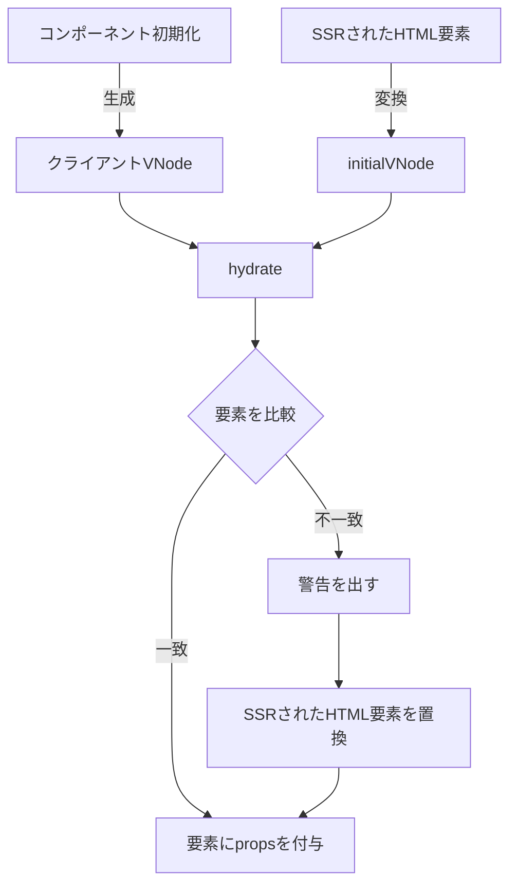
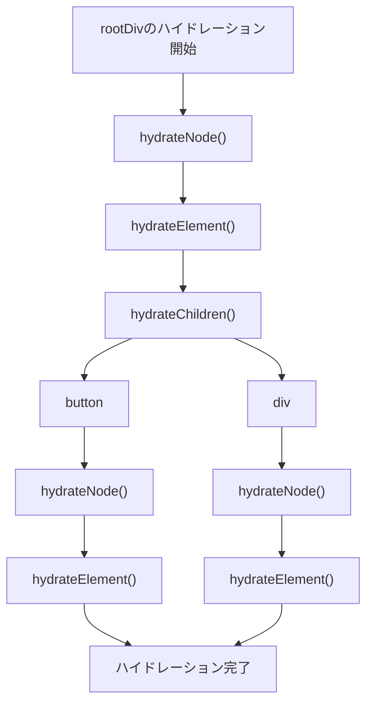

## はじめに

`[Vue warn]: Hydration ~~~ mismatch`の警告にたまに遭遇することがあり、そういえばハイドレーションをちゃんと理解してなかったので、自分のために記事を書いて理解していきます。

:::message

### 注意事項

-本記事はVue3.5.17で検証しています。
-VueのCSRの知識がある前提で書いています。
-ハイドレーションの処理の概要の理解を目指しているので、細かい処理は一部除外しています。
-すでにハイドレーションを知っていて、更に詳しくなりたい場合は、本記事よりも[Vueのリポジトリ](https://github.com/vuejs/core)を直接覗くか、[DeepWikiのVueハイドレーション解説](https://deepwiki.com/vuejs/core/6.2-hydration)にも詳細が書かれているので、そちらがおすすめです。

:::

## Vueのハイドレーションを知る

SSRで行われるハイドレーション（水和）は、物質が水と反応する化学反応の水和反応になぞらえて、乾いた静的なHTMLに水分となるJavaScriptを与えて、完全に機能するWebアプリケーションを作ることです。
VueでSSRする際は、[`createApp`](https://ja.vuejs.org/api/application#createapp)の代わりに[`createSSRApp`](https://ja.vuejs.org/api/application#createssrapp)を使ってハイドレーションを行います。VueでSSRしたいとき、多くの場合はNuxtを使うのが便利だと思います。（というよりほぼ一択？）

今回はシンプルな構成にするために、Viteでサンプルを作りました。
https://github.com/konkarin/vue-ssr-sandbox

ちなみに、`npm create vite-extra@latest`でssr-vueを選択しても簡単に作れます。

サンプルでは、ハイドレーションの前後をわかりやすくするために、あえてHydration mismatchを引き起こしています。これにより、SSRされた要素と、CSRされる要素に差分ができます。

https://github.com/konkarin/vue-ssr-sandbox/blob/main/src/App.vue

詳細は省略しますが、`src/entry-server.ts`と`server.js`では、Node.jsサーバー上でVueアプリケーションを一度完全にレンダリングして、生成したHTMLを返す処理をしています。

### 実際にハイドレーションを見る

`npm run dev`を実行してブラウザで`http://localhost:5173`を開き、開発者ツールのネットワークタブを見ると、レスポンスされるHTMLを確認できます。ここでは`count is 0`のHTMLが返されています。

しかし、ブラウザで実際に表示される画面では`count is 1`となっています。これがハイドレーションの結果です。

ハイドレーションは、ざっくりと以下のようなフローで処理されています。

SSRされたHTMLが`count is 0`、クライアントで初期化されるコンポーネントが`count is 1`となっており、このようにハイドレーションの結果に差分があれば、クライアント側の`count is 1`が優先されてHTMLが更新されます。

## ハイドレーションの処理を詳しく知る

では、ハイドレーションの処理を詳しく追っていきます。

`createSSRApp().mount("#app")`を実行します。`createApp`ではなく`createSSRApp`を使うことで、[`mount()`](https://github.com/vuejs/core/blob/347ef1d3f5a25e21ba0f2b1cc1e9730a5ac27001/packages/runtime-core/src/apiCreateApp.ts#L358-L419)で必ずハイドレーションが実行されます。また、`mount`の中で中身がほぼ空っぽなVNode(`initialVNode`)も生成されます。

https://github.com/vuejs/core/blob/347ef1d3f5a25e21ba0f2b1cc1e9730a5ac27001/packages/runtime-core/src/apiCreateApp.ts#L358-L419

ここからは、ハイドレーションの主要な関数を順番に説明していきます。

### [`hydrate`](https://github.com/vuejs/core/blob/347ef1d3f5a25e21ba0f2b1cc1e9730a5ac27001/packages/runtime-core/src/hydration.ts#L119-L135)

`createSSRApp().mount()`から呼び出され、`initialVNode`と`div#app`のNodeが渡されます。ここからハイドレーションが始まります。

https://github.com/vuejs/core/blob/347ef1d3f5a25e21ba0f2b1cc1e9730a5ac27001/packages/runtime-core/src/hydration.ts#L119-L135

### [`hydrateNode`](https://github.com/vuejs/core/blob/347ef1d3f5a25e21ba0f2b1cc1e9730a5ac27001/packages/runtime-core/src/hydration.ts#L137-L366)(1回目の呼び出し)

`div#app`のNodeと`initialVNode`が渡されて、Nodeに対してハイドレーションを行っていきます。最初は必ず`mountComponent`でルートコンポーネント（今回はApp.vue）を初期化します。それ以外の場合は後ほど説明します。

https://github.com/vuejs/core/blob/347ef1d3f5a25e21ba0f2b1cc1e9730a5ac27001/packages/runtime-core/src/hydration.ts#L137-L366

CSRとSSRでは`initialVNode`が持つプロパティに差分があります。CSRはまだレンダリングされていないため`initialVNode.el`は`null`、SSRはSSRされたHTMLが持つ要素（今回はApp.vueのrootのdiv）が入ります。

### [`mountComponent`](https://github.com/vuejs/core/blob/347ef1d3f5a25e21ba0f2b1cc1e9730a5ac27001/packages/runtime-core/src/renderer.ts#L1169-L1246)

https://github.com/vuejs/core/blob/347ef1d3f5a25e21ba0f2b1cc1e9730a5ac27001/packages/runtime-core/src/renderer.ts#L1169-L1246

ここで初めてルートコンポーネントのインスタンスが作られます。このインスタンスの`.vnode`プロパティに`initialVNode`も紐づけられます。`mountComponent`自体はCSRでもSSRでもそれほど変わりません。
`mountComponent`からは、コンポーネントの初期化のために様々な処理が呼ばれます。説明しきれないので今回は省略します。

### [`hydrateSubTree`](https://github.com/vuejs/core/blob/347ef1d3f5a25e21ba0f2b1cc1e9730a5ac27001/packages/runtime-core/src/renderer.ts#L1317-L1338)

コンポーネントインスタンスが持つサブツリー(VNode)を生成します。実際には1321行目の`renderComponentRoot`がサブツリーを生成します。

https://github.com/vuejs/core/blob/347ef1d3f5a25e21ba0f2b1cc1e9730a5ac27001/packages/runtime-core/src/renderer.ts#L1317-L1338

余談ですが、インスタンスが持つ`.subTree`と`.vnode`プロパティはどちらもVNodeですが、`.subTree`はコンポーネント内部で持っているNodeを指すVNodeで、`.vnode`はコンポーネント自身のVNodeを指しています。

`hydrateSubTree`はSSRされているときだけ`mountComponent`のあとに呼ばれる[`componentUpdateFn`](https://github.com/vuejs/core/blob/347ef1d3f5a25e21ba0f2b1cc1e9730a5ac27001/packages/runtime-core/src/renderer.ts#L1288-L1561)から呼ばれます。
CSRなら`hydrateSubTree`は呼ばれず、代わりに[`patch`](https://github.com/vuejs/core/blob/347ef1d3f5a25e21ba0f2b1cc1e9730a5ac27001/packages/runtime-core/src/renderer.ts#L374-L491)が呼ばれてコンポーネントをCSRします。

次以降の処理でもコンポーネントがあれば、また`hydrateSubTree`が呼ばれます。

### `hydrateNode`(2回目以降の呼び出し)

再び`hydrateNode`が呼ばれ、App.vueのrootのdivのNodeと`hydrateSubTree`で生成された`instance.subTree`(VNode)が渡されます。以降はNodeのツリーとVNodeツリーを親から子に再帰的に辿って、SSRされたNodeとクライアントのVNodeをハイドレーションします。エレメントだけでなく、コンポーネント、Teleport、Suspense、フラグメント、テキスト、コメントなど、タイプによって処理が異なります。

https://deepwiki.com/vuejs/core/6.2-hydration#hydration-process-overview

### [`hydrateElement`](https://github.com/vuejs/core/blob/347ef1d3f5a25e21ba0f2b1cc1e9730a5ac27001/packages/runtime-core/src/hydration.ts#L368-L552)

https://github.com/vuejs/core/blob/347ef1d3f5a25e21ba0f2b1cc1e9730a5ac27001/packages/runtime-core/src/hydration.ts#L368-L552

ElementがChildrenを持てば`hydrateChildren`が呼ばれます。ChildrenのNodeに対し、`hydrateNode`が呼び出され、Nodeツリーを走査していきます。`hydrateElement`がミスマッチのチェックとミスマッチがあったときの要素の更新を行い、propsとイベントハンドラをバインドします。

例えば、サンプルのApp.vueの`hydrateSubTree`以降の処理フローは次のようになります。

ハイドレーションが終わると、その後はCSRと同じ動作になります。リポジトリのコードに少し説明を加えただけなので、実際に手元で動かしたり、自分で処理を追いかけるとより理解が深まると思います。

## おわりに

今回は備忘録の側面が強い記事になりました。ハイドレーションの完全な説明をするのは複雑なので、一旦は概要の理解にとどめています。

最初は自力でデバッグしながら調べていましたが、途中からめんどくさくなってDeepWiki使って色々質問しながら書きました。もはや記事よりDeepWikiでいいや〜とも思いましたが、頑張って最後まで書きました。DeepWikiや各種エージェントのお陰で調べものと執筆作業はグンと楽になった、いい時代ですね。
